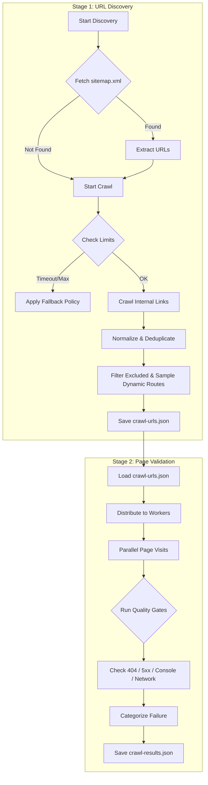

# 2-Stage Crawler Architecture

## Overview
This document describes the 2-Stage Crawler Architecture implemented for the QA Automation framework. The goal is to separate **URL Discovery** from **Page Validation** to improve stability, scalability, and performance clarity.

## Architecture Diagram



## Stage 1: URL Discovery (Fast)
**Module**: `utils/crawlerDiscovery.ts`  
**Command**: `npm run crawl:discover`

### Features
- **Sources**: Uses `sitemap.xml` (priority) and internal link crawling.
- **Normalization**: Strips hash, trailing slashes, and tracking params.
- **Exclusion**: Skips URLs matching patterns in `config/keyPages.ts`.
- **Dynamic Sampling**: Limits repeated dynamic routes (e.g., `/items/:id`) to `sampleDynamicRoutes` (default: 5).
- **Fallback Policy**:
  - Target time: 60 seconds.
  - If timeout occurs, reduces `maxPages` by 25% and `maxDepth` by 1 to ensure completion.
- **Output**:
  - `crawl-urls.json`: List of unique URLs with metadata.
  - `crawl-discovery-summary.json`: Discovery metrics.

## Stage 2: Page Validation (Heavy)
**Module**: `utils/crawlerValidation.ts`  
**Command**: `npm run crawl:validate`

### Features
- **Parallel Execution**: Validates pages concurrently (internal queue).
- **Quality Gates**:
  - **CRITICAL** (Fails Build):
    - `5xx` Server Errors
    - Page Crash / JS Execution Failure
    - Blank Page (body < 50 chars)
  - **WARNING** (Report Only):
    - `404` Not Found (after filtering false positives)
    - `timeout` (Page load exceeded limit)
    - `console_error` (JS errors, excluding benign ones)
    - `network_failure` (4xx internal API failures)
- **Smart 404 Detection**:
  - Detects "Soft 404" in SPAs (document 200 but content "Page Not Found").
  - Identifies Auth Redirects (redirect to `/login`) as Warnings, not Failures.
- **Output**:
  - `crawl-results.json`: Detailed per-page results.
  - `crawl-validation-summary.json`: Aggregated pass/fail metrics.

## Configuration

| Environment Variable | Default | Description |
|----------------------|---------|-------------|
| `CRAWLER_WORKERS`    | 5       | Number of concurrent page validations |
| `PAGE_TIMEOUT`       | 30000   | Timeout for specific page load (ms) |
| `LOT_BASE_URL`       | ...     | Target website URL |

## How to Run

### Full Crawl (Discovery + Validation)
```bash
npm run crawl:full
```

### Independent Stages
```bash
# Step 1: Discover
npm run crawl:discover

# Step 2: Validate (uses output from Step 1)
npm run crawl:validate
```

## Troubleshooting

### "Discovery returned 0 pages"
- Check `LOT_BASE_URL`.
- Verify `sitemap.xml` exists.
- Check if site requires authentication (currently discovery is unauthenticated by default, but can use setup state if configured).

### "Validation Timeout"
- Increase `PAGE_TIMEOUT`.
- Reduce `CRAWLER_WORKERS` if CPU/Memory is bottlenecked.

### "Too many 404s"
- Check `crawl-results.json` for patterns.
- If they are valid pages requiring login, exclude them in `config/keyPages.ts` or fix auth setup.
- If they are false positives, check the "Smart 404" logic in `crawlerValidation.ts`.
