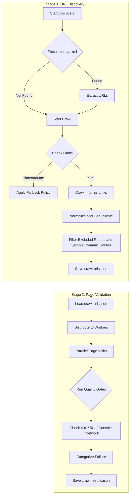

# 2-Stage Crawler Architecture

## Overview

This document describes the crawler architecture used by the Web QA Automation Tool. The crawler separates **URL Discovery** from **Page Validation** so QA runs are easier to debug, scale, and reuse across different websites.

## Architecture Diagram


```mermaid
graph TD
    subgraph Stage 1: URL Discovery
        A[Start Discovery] --> B{Fetch sitemap.xml}
        B -->|Found| C[Extract URLs]
        B -->|Not Found| D[Start Crawl]
        C --> D
        D --> E{Check Limits}
        E -->|Timeout/Max| F[Apply Fallback Policy]
        E -->|OK| G[Crawl Internal Links]
        G --> H[Normalize and Deduplicate]
        H --> I[Filter Excluded Routes and Sample Dynamic Routes]
        I --> J[Save crawl-urls.json]
    end

    subgraph Stage 2: Page Validation
        K[Load crawl-urls.json] --> L[Distribute to Workers]
        L --> M[Parallel Page Visits]
        M --> N{Run Quality Gates}
        N --> O[Check 404 / 5xx / Console / Network]
        O --> P[Categorize Failure]
        P --> Q[Save crawl-results.json]
    end

    J --> K
```

## Stage 1: URL Discovery

**Module**: `utils/crawlerDiscovery.ts`  
**Command**: `npm run crawl:discover`

### Features

- Uses `sitemap.xml` first, then falls back to internal link crawling
- Normalizes URLs by removing hashes, trailing slashes, and tracking parameters
- Excludes routes configured in `config/keyPages.ts`
- Samples repeated dynamic routes such as `/items/:id`
- Applies a timeout fallback policy to reduce crawl scope when needed
- Saves URL and summary outputs for later validation

### Outputs

- `crawl-urls.json`
- `crawl-discovery-summary.json`

## Stage 2: Page Validation

**Module**: `utils/crawlerValidation.ts`  
**Command**: `npm run crawl:validate`

### Features

- Validates pages concurrently with an internal worker queue
- Classifies failures by severity
- Detects server errors, blank pages, soft 404s, timeouts, console errors, and internal network failures
- Separates critical failures from warnings so teams can decide what should block a release

### Outputs

- `crawl-results.json`
- `crawl-validation-summary.json`

## Configuration

| Environment Variable | Default | Description |
|---|---:|---|
| `QA_BASE_URL` | `http://localhost:3000` | Target website URL |
| `QA_INTERNAL_DOMAINS` | Base URL hostname | Comma-separated domains that should pass network quality gates |
| `QA_CRAWL_EXCLUSIONS` | - | Extra route patterns to exclude from crawling |
| `QA_IGNORED_BROKEN_LINK_PATTERNS` | - | URL patterns to ignore during broken-link checks |
| `CRAWLER_WORKERS` | `5` | Number of concurrent page validations |
| `PAGE_TIMEOUT` | `30000` | Page load timeout in milliseconds |

Legacy `LOT_BASE_URL` is still supported as a fallback for older setups.

## How to Run

```bash
# Discovery + validation
npm run crawl:full

# Discovery only
npm run crawl:discover

# Validation only, using crawl-urls.json
npm run crawl:validate
```

## Troubleshooting

### Discovery returned 0 pages

- Check `QA_BASE_URL`
- Verify the site is reachable from the test environment
- Check whether the site requires authentication
- Review `QA_CRAWL_EXCLUSIONS` and `config/keyPages.ts`

### Validation timeout

- Increase `PAGE_TIMEOUT`
- Reduce `CRAWLER_WORKERS`
- Lower `maxPages` or `maxDepth` in the crawler test

### Too many 404s

- Check `crawl-results.json`
- Add known acceptable routes to `QA_IGNORED_BROKEN_LINK_PATTERNS`
- Exclude irrelevant routes in `config/keyPages.ts`
- Confirm whether pages require login state before validation
